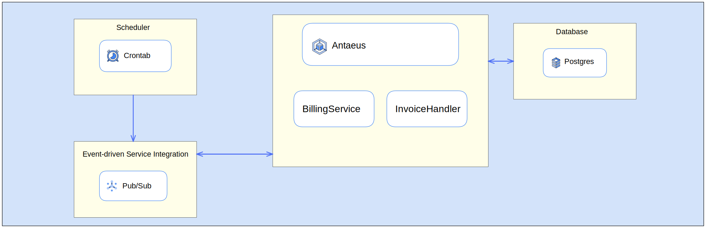

## pleo-be-challenge

This repository is a personal solution proposal of the [Pleo Backend Challenge](https://github.com/pleo-io/antaeus).
The task is to build the logic that will schedule payments of invoices on the first of the month. The solution requires
docker to be installed on your machine, and relies on Postgres for the persistence layer and on Google PubSub (via the
official emulator) for the asynchronous communication between different application components and other external
systems.

<!-- TOC -->
  * [pleo-be-challenge](#pleo-be-challenge)
  * [Process](#process)
    * [Familiarize with the project (1h spent)](#familiarize-with-the-project--1h-spent-)
    * [Work plan (1h spent)](#work-plan--1h-spent-)
    * [Core functionality (2h spent)](#core-functionality--2h-spent-)
    * [Scheduling (2h spent)](#scheduling--2h-spent-)
    * [Focus on scalability and reliability (4h spent)](#focus-on-scalability-and-reliability--4h-spent-)
    * [Testing (3h spent)](#testing--3h-spent-)
  * [Architectural overview](#architectural-overview)
    * [Sequence diagram](#sequence-diagram)
  * [Running the solution](#running-the-solution)
  * [Future improvements and conclusion](#future-improvements-and-conclusion)
<!-- TOC -->

## Process

_Please note that the commit on the master branch is squashed, but you can still see the commit history from the
relevant
[PR](https://github.com/AlessandroBagnoli/pleo-be-challenge/pull/2) history._

### Familiarize with the project (1h spent)

Studied the project structure, understanding what is already there and what needs to be done reading the requirements.
Updated Gradle and dependencies to the newest versions.

### Work plan (1h spent)

1. Core functionality.
2. Scheduling.
3. Focus on scalability and reliability.
4. Unit and functional testing.

### Core functionality (2h spent)

The first step I did was implementing the main business logic which included:

1. Fetching the invoices in `PENDING` status from the DAL.
2. Processing each one of them calling the `charge` method of the `PaymentProvider`.
3. Handling the outcomes and possible exceptions that could occur during the charge phase.

Since the `PaymentProvider` may return some kind of unsuccessful outcomes that could be retried, as well as others that
could be unrecoverable, I decided to introduce two new statuses for the invoices: `FAILED` for those that incurred in
unrecoverable errors during the charge (like the `CustomerNotFoundException` and the `CurrencyMismatchException`),
and `RETRY` for those that can be retried because of recoverable outcomes (like the `NetworkException`, or the missed
charging because of insufficient balance). All this was implemented in the `BillingService` class, and because it is
a potentially time-consuming operation I decided to leverage the coroutines offered by the Kotlin language, without
blocking the main thread during the process.

### Scheduling (2h spent)

I still needed to find a way to schedule the billing process of the invoices the first day of each month: for a rapid
prototyping I initially implemented a first version in which a coroutine was running indefinitely and delaying the
execution by the amount of time between the first day of the next month, and
now: [here](https://github.com/pleo-io/antaeus/commit/2bb8ec4e93d636914fb3c4729b150ff4bfb20788).<br>
Of course, this is a pretty naive approach and things can go wrong in many ways going ahead with it. Also, we
are adding another responsibility in our Antaeus service, which is not ideal. Said that, what I decided to do in the
end, was to create an independent scheduler using `cron` inside a dedicated docker container, refactoring the already
in place docker implementation with a docker-compose file.

With a crontab we have now full flexibility regarding the job
scheduling, and we separated responsibilities from Antaeus. We still need one thing to figure out though: how to tell
Antaeus to initiate the billing process? I had two possible approaches in mind:

* Do an HTTP call to Antaeus leveraging the already in place HTTP controller.
* Publish a message on a messaging service.

I decided to go with the second option in order to decouple as much as possible the scheduler from Antaeus. In order to
achieve that, I chose Google PubSub as my go-to messaging service. Again, also PubSub has been containerized, using the
official emulator provided by Google.

The publishing of the message on PubSub from the scheduler is performed calling a REST endpoint exposed directly by
PubSub, encoding the message we want to publish in base64 format:

```shell
curl --location 'http://pubsub:8085/v1/projects/pleo/topics/billing_trigger:publish' \
  --header 'Content-Type: application/json' \
  --data '{
      "messages": [
          {
              "data": "UEVORElORw=="
          }
      ]
  }'
```

Here, `UEVORElORw==` is the base64 representation of the string `PENDING`. So what we are doing here is publishing
the string `PENDING` on the `billing_trigger` topic, which can be later on be received by Antaeus, totally
asynchronously and start the billing process for all those invoices in `PENDING` status.

Since we also introduced the `RETRY` status for invoices, as mentioned before, I thought it would be nice to add also a
cron job executed every 5 minutes which publishes the string `RETRY` on the same topic, so that when it is delivered to
Antaeus, it knows that it has to start the billing process for those specific invoices.

### Focus on scalability and reliability (4h spent)

At this point I had an overall basic solution which does the job as per the requirements, but there was still some room
for improvements to make the solution more scalable and reliable. In particular what I decided to do was:

* Replacing sqlite with Postgres.
* Decoupling the charging operation of the invoice from the BillingInvoice, treating each invoice independently.

For the first point, I refactored once again the docker-compose file including an instance of Postgres. Antaeus wise,
thanks to the `Exposed` library, replacing the connection parameters with the connection string and the driver name
required to establish a connection with Postgres was enough. I also took the chance to do an additional optimization
using `HikariCP` for creating a connection pool at the startup of the application, avoiding to create a new connection
to the database before every query: as the application scales up, the constant opening and closing of connections
becomes more expensive and potentially can begin to impact the app's performance. Also for this `Exposed` came to help,
since it has the ability to use a `Datasource` for interaction with the
database, [out of the box](https://github.com/JetBrains/Exposed/wiki/DataBase-and-DataSource).

For the second point, I decided to leverage the already set up infrastructure, using once again PubSub: each invoice
retrieved by the BillingService, is published as a single message on a dedicated PubSub topic.
From now on, we can think about who should be responsible for processing the single invoice, and for the sake of
simplicity I decided to use a new subscriber always on Antaeus which handles the invoice: `InvoiceHandler`.

> Please note that this specific part could have been handled differently in a production grade environment: for
> instance, using GCP as cloud provider of choice, we could also use a serverless function deployed
> on [Cloud Functions](https://cloud.google.com/functions) listening for invoices event, delegating the charging process
> outside Antaeus.

As a bonus point, I also took the chance to add the sending of a notification via PubSub in case of successful
operation, or unrecoverable exception during the charging phase of the invoice.

The final flow is depicted in the [sequence diagram](#sequence-diagram) paragraph down below.

### Testing (3h spent)

The testing was done via unit and functional testing, in particular I unit tested both the `BillingService` and the
`InvoiceHandler`. The former is responsible for gathering all the invoices in a given state and publish them on a
dedicated PubSub topic, while the latter takes care of handling a single invoice, atomically.

However, unit testing may not be enough for this kind of projects: we need to make
sure that also the interactions with the external components like the Postgres DB and PubSub work as expected before
deploying and testing the real system. With that in mind, I used [testcontainers](https://www.testcontainers.org/)
to effectively test all the application components which required external system to be up and running, without mocking
them. What it does is creating short-lived docker containers to mimic a real world environment during the execution of
the test suite.

So, the first thing I did was using a [gradle plugin](https://github.com/unbroken-dome/gradle-testsets-plugin) which
enables to separate the unit tests from the functional tests in different folders, and also split their execution with
dedicated gradle tasks, since functional tests requires docker, and they are way more expensive than unit tests, we may
not want to always execute them.

* `./gradlew test` executes the unit test.
* `./gradlew functional` executes the functional test.
* `./gradlew check` executes both the unit and the functional tests.

After that, I functionally tested all the PubSub publishers and subscribers, the DAL, ending with a full flow functional
test which:

* Instantiates all the application components and does the DI job
* Mocks the `PaymentProvider` to always return `true` (notice that this is the only mandatory mocked component)
* Saves an Invoice in `PENDING` status into the DB
* Publishes the message used for triggering the invoice processing flow on the dedicated PubSub topic
* Awaits for the successfully paid invoice notification to be correctly delivered
* Asserts that on the DB the invoice is in `PAID` status

Yes, I am aware that this full functional flow test is a bit simplistic. Assuming that we have only one invoice to be
processed is an optimistic and far from a real world scenario where we could expect thousands of invoices to process,
but still, it's a good starting point to make sure that the flow works as expected :smile:.

## Architectural overview

Building blocks of the solution. Every yellow square represents a self-contained docker service:



### Sequence diagram

Here you should see the sequence diagram automatically rendered in your IDE/Github. If that is not the case, and you
see only some code, please copy and paste it on the [mermaid live editor](https://mermaid.live/) to see the visual
representation.

````mermaid
sequenceDiagram
        participant CS as Scheduler
        participant PS as PubSub
        participant BS as BillingService
        participant IH as InvoiceHandler
        participant PG as Postgres
        Note over CS: every first day of the month at 00:00 UTC for invoice in PENDING status
        Note over CS: every 5 minutes for invoices in RETRY status
        CS--)PS: publish trigger on billing_trigger topic via PubSub REST API
        PS--)BS: trigger delivered via subscriber on antaeus_svc-billing_trigger subscription
        BS->>PG: get all invoices in status
        PG->>BS: 
        loop each invoice
            BS--)PS: publish invoice on invoices topic
        end
        PS--)IH: invoice delivered via subscriber on antaeus_svc-invoices subscription
        IH->>IH: handle the invoice calling PaymentProvider
        opt in case of success or unrecoverable exception
            IH--)PS: send notification to customer with the status
        end
        IH->>PG: save the status
````

## Running the solution

Running `./docker-start.sh` will execute a `docker-compose up -d` that will start automatically the needed services.

Once the services are up and running, the `scheduler` will execute the jobs as explained above. However, if you don't
want to wait for the first day of the month (understandable :smile:), you can import in Postman the collection located
in the `collection` folder. It contains basically the same requests that the `scheduler` makes: one which publishes a
message on PubSub for triggering the processing of the invoices in `PENDING` status, and the other which does the same
for the invoices in `RETRY` status, via the REST APIs exposed by PubSub.

## Future improvements and conclusion

There is still some room for improvements and decisions to be taken, both from a functional and technical point of view.
A couple of examples:

* Setting a maximum number of attempts of the retrial of billing invoices.
* Handling in some other way the `CurrencyMismatchException`, maybe leveraging
  some [third party service](https://www.currencycloud.com/) to do a foreign exchange on the fly.
* Setting a deduplication mechanism for the delivered PubSub messages: by design, PubSub ensures an at-least-once
  delivery policy. It is up to you ensuring the idempotency of the subscriber. Given that we are talking about delicate
  process as payment of billings, for sure we don't want the customers to be billed twice or more for the same invoice.
  Alternatively it is possible also to set up the subscriptions to support an exactly-once delivery.

Overall I really enjoyed the time spent thinking about a solution and implementing it.<br>
I liked the challenge: it was different from the classic "write a Spring Boot CRUD application" kind of
challenge :smile: and it also gave me the opportunity to know and put hands on a few libraries and tools I never worked
with, like `Gradle` (always used `Maven`), `Exposed`, `Javalin`, and `Mockk` (always used `Mockito`).